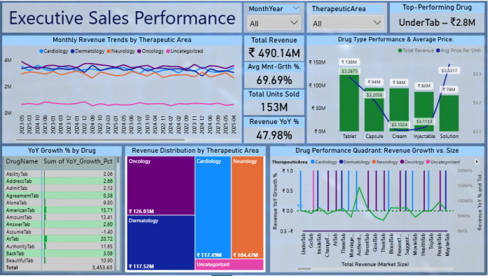
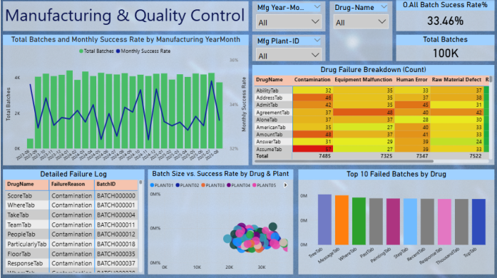

# 💊 Pharmaceutical Sales & Manufacturing Performance Dashboard  

## 📌 Project Overview  
This **Power BI dashboard** provides a comprehensive, data-driven solution for analyzing **sales performance** and **manufacturing efficiency** within a pharmaceutical company.  
It enables stakeholders to **identify growth opportunities, monitor product quality, and make informed strategic decisions**.  

---

## 🎯 Business Problem & Goal  
In the dynamic pharmaceutical industry, companies face challenges such as:  
- Optimizing sales strategies  
- Ensuring product quality  
- Identifying high-potential drugs  

Traditional reporting often lacks interactivity and depth, leading to missed opportunities and inefficiencies.  

This project addresses these challenges by consolidating data into an **interactive Power BI dashboard**. The primary goals are to:  
- Analyze drug sales performance across dimensions (therapeutic area, region)  
- Identify YoY growth trends & top-performing products  
- Monitor manufacturing batch success rates & common failure reasons  
- Discover optimal batch sizes & plant performance  
- Uncover strategic investment opportunities based on product lifecycle & growth potential  

---

## 📊 Key Insights & Business Value  
- **Identify Growth Drivers** → Monthly revenue trends, YoY growth %, and overall average monthly growth  
- **Optimize Product Portfolio** → 'Drug Type Performance & Opportunity' chart highlights revenue vs. average price per unit (e.g., Tablets vs. Injections)  
- **Enhance Manufacturing Efficiency** → 'Overall Batch Success Rate' KPI + 'Drug Failure Breakdown' heatmap (e.g., "Drug X has highest contamination failures")  
- **Inform Production Strategy** → Batch size vs. success rate scatter plot guides production planning  
- **Strategic Investment Allocation** → Combines sales & manufacturing quality data to guide resource allocation  

---

## ⚙️ Technical Skills & Tools Utilized  

### 🔹 Microsoft Power BI Desktop  
- **Data Acquisition & Transformation (Power Query / M Language):** Complex data cleaning (mixed dates, missing values, outliers, inconsistent text), optimized data loading  
- **Data Modeling:** Robust Star Schema, one-to-many relationships, Calendar table for time intelligence  
- **DAX:** Advanced measures (YTD, YoY), conditional logic, AVERAGEX, SUMMARIZE, custom sorting  
- **Visualization & UX:** Multi-page dashboards (line charts, matrices, scatter plots, combo charts, treemaps, cards, slicers), slicer sync, tooltips  

### 🔹 SQL (MySQL)  
- **Database Integration:** Direct Power BI ↔ MySQL connection  
- **Advanced Querying:** CTEs, window functions (e.g., `LAG()`)  
- **Data Cleansing:** Mixed date handling, missing numerical values, text standardization  

### 🔹 Python  
- **Data Generation:** Custom scripts using **Pandas, NumPy, Faker** to simulate realistic datasets with data quality issues  
- **Problem Solving:** Analytical debugging of quality issues & transformations  

---

## 🗂️ Data Source & Methodology  

The dataset is **synthetic** (generated via Python) to mimic real-world pharma complexities (mixed dates, missing values, outliers).  

**Key Data Entities:**  
- **Drugs:** DrugID, DrugName, TherapeuticArea, DrugType, AvgCostPerUnit  
- **Sales:** SaleID, SaleDate, DrugID, Region, UnitsSold, Revenue  
- **Manufacturing Batches:** BatchID, DrugID, ManufacturingDate, PlantID, BatchSize, Status, FailureReason  

**Methodology:**  
1. **Raw Data Generation (Python)** → CSV files with real-world complexity  
2. **Initial Cleansing (Power Query)** → Standardized formats, handled missing data, flagged outliers  
3. **Database Integration (MySQL)** → Advanced cleansing (DECIMAL conversion, date handling)  
4. **Data Modeling (Power BI)** → Star Schema, fact & dimension tables  
5. **Advanced Analysis (DAX + SQL)** → KPIs, YoY trends, window functions  
6. **Dashboard Development (Power BI)** → Multi-page visuals for sales + manufacturing  

---

## ⚡ Challenges & Solutions  

- **Mixed Date Formats (CSV):**  
  - *Challenge:* Inconsistent date formats prevented conversion  
  - *Solution:* Used `try...otherwise` in Power Query + `STR_TO_DATE` + `REGEXP` in MySQL  
  - *Learning:* Explicit parsing & tool-specific cleaning is critical  

- **Power BI Date Hierarchy Issues:**  
  - *Challenge:* Calendar relationship not enabling hierarchy  
  - *Solution:* Created DAX `YearMonth` column + `SORTBYCOLUMN` workaround  
  - *Learning:* Deep dive into Power BI date handling & metadata behavior  

- **MySQL Connectivity & Type Mismatches:**  
  - *Challenge:* ODBC errors, data truncation during imports  
  - *Solution:* Fixed driver/auth issues, imported as `VARCHAR`, converted with `CAST` & `NULLIF`  
  - *Learning:* Robust import strategies + SQL cleansing best practices  

- **DAX Measure Discrepancies:**  
  - *Challenge:* Lost measures after schema changes, inflated totals from pre-aggregated data  
  - *Solution:* Rebuilt measures from transaction-level data  
  - *Learning:* Importance of context-aware DAX & avoiding double aggregation  

---

## 📸 Dashboard Screenshots  

### Page 1: Executive Sales Performance  
- Overview of sales trends, drug performance, and revenue distribution  
  

### Page 2: Manufacturing & Product Quality  
- Batch success rates, failure root causes, and production analysis  
  

---

✨ This project highlights **end-to-end BI development** – from raw synthetic data to **strategic, interactive dashboards**.  

---

